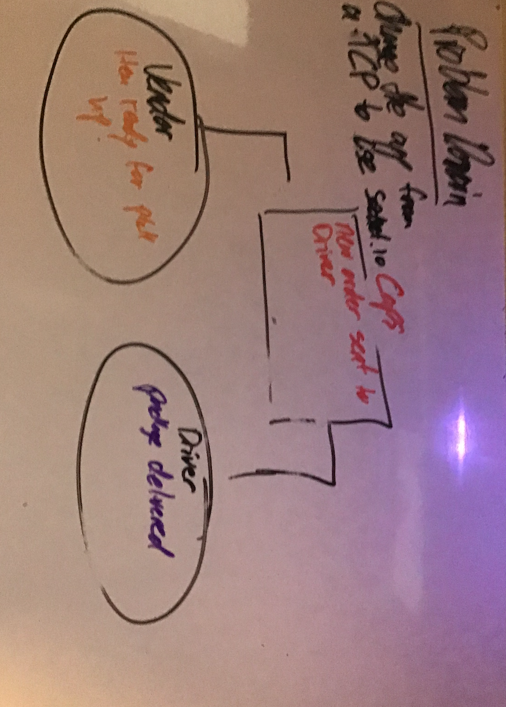

#  Lab 12: FOOD DELIVERY|Socket.IO

# Challenge Summary

Change the app we made yesterday into an app that uses socket.io instead of tcp

## Challenge Description

Create an app that logs when a new order is place and then is sent to the vendor which logs it and then sends it to the delivery driver who picks it up and logs it and then sends another log when the item is delivered

## Approach & Efficiency

idk... this was hard

## Solution
